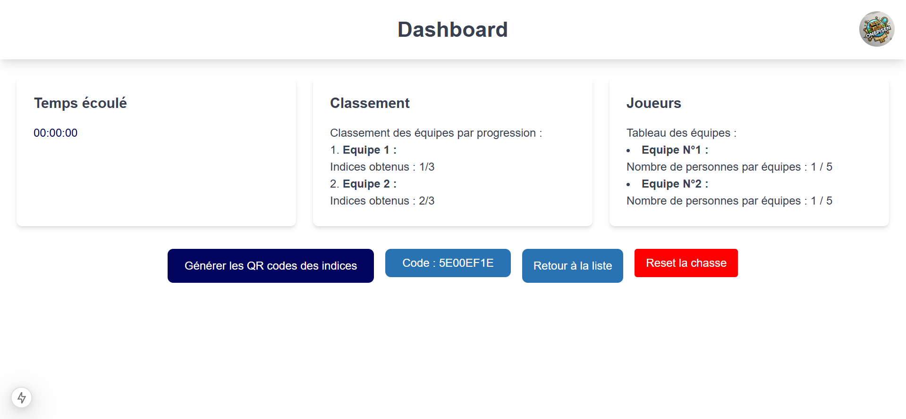
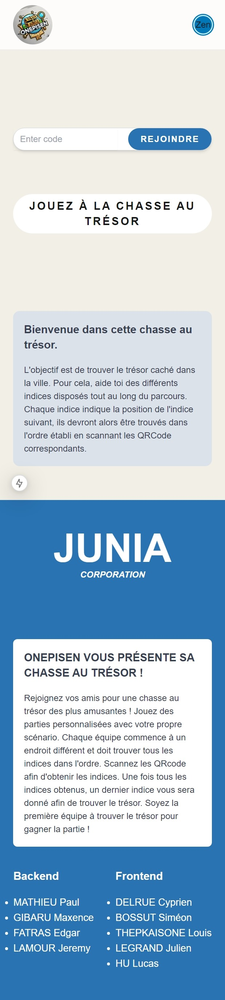
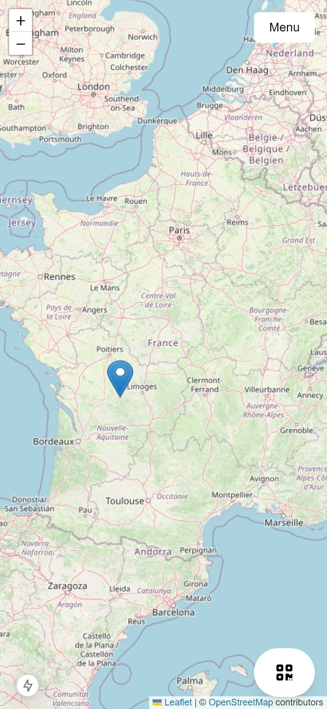

# CIR3 Project

## Getting Started

To set up and run this project, please follow the steps below:

### Prerequisites

- **Node.js**: Ensure that Node.js version 18.18 or later is installed on your system. You can download it from the [official Node.js website](https://nodejs.org/).

### Installation

1. **Clone the repository**:

   ```bash
   git clone [repository_url]
   ```

2. **Navigate to the project directory**:

   ```bash
   cd [project_directory]
   ```

3. **Install dependencies**:

   For the first-time setup, install the necessary packages by running:

   ```bash
   npm install
   ```

### Running the Development Server

To start the development server, execute:

```bash
npm run dev
```

Once the server is running, open your browser and navigate to [http://localhost:3000](http://localhost:3000) to view the application.

## Additional Information

- **Fonts**: This project utilizes [next/font](https://nextjs.org/docs/app/building-your-application/optimizing/fonts) for automatic optimization and loading of [Geist](https://vercel.com/font), Vercel's new font family.

- **Color Palette**: The project's color scheme is based on the following palette:

  

  You can view and adjust the palette using [Coolors](https://coolors.co/palette/111938-442656-59477a-6d3a8b-6340a2-803db0-672185-1f257d-181f5b-161a32).

For more detailed information on setting up a Next.js project, refer to the [Next.js Installation Guide](https://nextjs.org/docs/getting-started/installation).


## Functionalities

**Global Features**  
Teams (at least one) must find a treasure by following a series of clues forming a cyclic route. This allows each team to start at a different stage and prevents teams from merging. At each clue found, a narrative resource associated with it, but independent of the clue, becomes accessible. These resources tell the story written by the organizer or generated by AI. The menu also includes a button to access the rules and exit the game. Once all clues are found, a final clue leads to the treasure. At the end, a leaderboard shows the time taken by each team.  

**Creating a Treasure Hunt**  
Organizers, who have an account, can create or manage their hunts from a dedicated page. To create a hunt, they define the story in blocks: an introduction (not AI-generated), resource blocks associated with the clues, and a conclusion (all AI-generable). The number of steps corresponds to the number of resources created. Organizers then place the clues on a map, generating QR codes for each step. They define the number of teams and members per team before returning to the homepage to manage or launch the hunts.  

**The Game for Organizers**  
Once a hunt is selected, the organizer accesses a dashboard to download a PDF of the QR codes and generate an event code. During the game, they can view statistics: overall progress percentage, progress by team, and elapsed time.  

**The Game for Players**  
Players join a game using a code generated by the organizer. They select a team, view the map, and find the clues represented as bubbles. By clicking on a bubble, they access a clue leading to the next step, as well as the associated resource. After finding and scanning a QR code, they unlock the next step.  

**QR Codes**  
QR codes, generated from a unique ID, unlock the steps and associated resources. A scanned code verifies in the database that it corresponds to the current step. If correct, the next clue and the associated resource are unlocked. Codes must be scanned in order, and each scan adds a bubble on the map at the approximate location where it was found.

## Capture d'écran 



